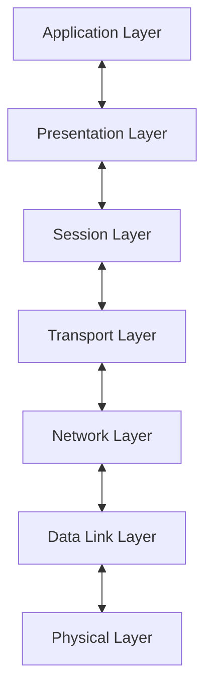

# osi-model

```mermaid
graph TD;
    A[Application Layer] <--> B[Presentation Layer];
    B <--> C[Session Layer];
    C <--> D[Transport Layer];
    D <--> E[Network Layer];
    E <--> F[Data Link Layer];
    F <--> G[Physical Layer];

```
